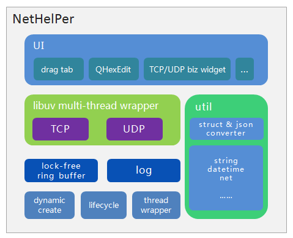

# DNetHelPer网络调试工具 - 设计总览  

DNetHelPer网络调试工具（简称Nh工具）是使用C++、基于QT5.13编写的跨平台应用层TCP、UDP网络数据调试工具。  

设计本工具的初衷，一方面是便于业务开发中的调测试工作；另一方面，作为普通的CVer，学习积累过程中，希望能够有一些的简单业务组件/方案，比较容易的在其他监测控制类应用中，被复用。比如，对象生命周期、轻量级日志、无锁同步缓冲池、持久化、libuv的多线程封装等功能的组件，分别的保持较小规模的第三方依赖（但仍然可能需要QT库）后，可以被有选择的、单独的用在其他应用的基础框架里。  

下图展示了Nh工具的应用结构（其中，QHexEdit是对[原作者项目](https://github.com/Simsys/qhexedit2)进行了修改，以便显示10表示的二进制）



下面，我们从下到上的对每个组件的设计（除了ui层以外，其余的均视为业务层，位于bina包内），进行说明。

## dynamic create  
  
  dynamic create（运行时创建、动态绑定）的行为，在整个Nh工具，以至别的C++应用的构建中，应该都是第一位的。  

  在java应用开发中，运行时创建，是非常容易操作的：利用reflect，在运行时，提供一个类名字符串xxx，就可以使用Class.forName("xxx").newInstance()来创建得到这个类的对象/实例。  
  在C++中，想实现reflect，并不是一件直接的事情，需要主动的在应用实现中进行构造，以实现dynamic create。  
  
  由于在C++中，运行时创建的实现，只是一件不是直接的事情（并不是不常见或困难的事情），因此，在Nh工具内，直接拆轮子参考了古老版本的MFC，摘录了其要点，形成了运行时根据类名字符串，创建对象的功能。  
  
  主要的实现，依赖于以下两个宏：
  > DECLARE_CORE_DYNCREATE(classname)  
  > IMPLEMENT_CORE_DYNCREATE(classname)  
  
  简单的示例如下：  
  ```C  
  #include <iostream>
  #include "./bina/core/util/DynamicCreate.h"
  
  class Shape {
  DECLARE_CORE_DYNCREATE(Shape)
  public:
      virtual void doWork() {
          std::cout << "obj's class is Shape" << std::endl;
      }  
  };
  
  IMPLEMENT_CORE_DYNCREATE(Shape)
  
  class Circle : public Shape {
  DECLARE_CORE_DYNCREATE(Circle)
  
  public: 
      virtual void doWork() {
          std::cout << "obj's class is Circle" << std::endl;
      }  
  };
  
  IMPLEMENT_CORE_DYNCREATE(Circle)
  
  int main() {
      std::string clsName = "Circle";
      Shape* obj = (Shape*)CObjectFactory::getInstance()->createObject(clsName);
      if (obj) {
          obj->doWork();
          delete obj;
          obj = nullptr;
      }
      
      return 0;
  }
```  
  如上面的示例中，为了实现运行时创建，在类的声明中，需要添加一个DECLARE_CORE_DYNCREATE(classname)宏；而在类的定义文件内，需要对应的添加一个IMPLEMENT_CORE_DYNCREATE(classname)。  
  这一组宏，其实是声明、定义了几个静态的成员变量/方法，以便应用在初始化时，借用静态成员的初始化特点，形成一个<类名, 类创建方法>的映射集；然后，在需要创建类实例对象的时候，就可以直接的使用CObjectFactory的createObject方法进行创建了。  
  
  运行时创建的头文件bina/core/util/DynamicCreate.h，仅依赖了标准C++库的map、string，因此，基本在任何的C++应用里，都可以方便的使用它。  
  

## lifecycle  

spring框架采用模板模式，以及巨量的可override锚点（直观的感受），实现了管理对象生命周期的若干套强大方案。但是，在中间件、监测控制类应用中，对生命周期的状态集界定，也可以是一个相对较小（并不与spring冲突）的集合，即对应着一个简单的实现。  
一般来说（Nh工具及其他的监测控制类应用），我们使用的仅是init、start、stop、destroy等操作（针对before、after等特例化的需求，也可以局部的再实现）。这种明确简单的生命周期管理，也早有各种著名应用进行了实现，tomcat便是其中一个。  
下面是这个生命周期的说明图（摘自[tomcat7.0.x](https://github.com/apache/tomcat/blob/7.0.x/java/org/apache/catalina/Lifecycle.java)）。  
  
```  
	/**
	 *            start()
	 *  -----------------------------
	 *  |                           |
	 *  | init()                    |
	 * NEW -»-- INITIALIZING        |
	 * | |           |              |     ------------------«-----------------------
	 * | |           |auto          |     |                                        |
	 * | |          \|/    start() \|/   \|/     auto          auto         stop() |
	 * | |      INITIALIZED --»-- STARTING_PREP --»- STARTING --»- STARTED --»---  |
	 * | |         |                                                            |  |
	 * | |destroy()|                                                            |  |
	 * | --»-----«--    ------------------------«--------------------------------  ^
	 * |     |          |                                                          |
	 * |     |         \|/          auto                 auto              start() |
	 * |     |     STOPPING_PREP ----»---- STOPPING ------»----- STOPPED -----»-----
	 * |    \|/                               ^                     |  ^
	 * |     |               stop()           |                     |  |
	 * |     |       --------------------------                     |  |
	 * |     |       |                                              |  |
	 * |     |       |    destroy()                       destroy() |  |
	 * |     |    FAILED ----»------ DESTROYING ---«-----------------  |
	 * |     |                        ^     |                          |
	 * |     |     destroy()          |     |auto                      |
	 * |     --------»-----------------    \|/                         |
	 * |                                 DESTROYED                     |
	 * |                                                               |
	 * |                            stop()                             |
	 * ---»------------------------------»------------------------------
	 *
	 */
   
```
  
在拆轮子学习的驱动下，从[tomcat7.0.91](http://archive.apache.org/dist/tomcat/tomcat-7/v7.0.91)中，我们提取了org.apache.catalina包内相关的类，并将其转换为了C++语言（暂时未加上license）。仅选取了与生命令周期最紧密的一些类，这些类如以下：
```  
	Lifecycle
	LifecycleBase
	LifecycleEvent
	LifecycleException
	LifecycleListener
	LifecycleState
	LifecycleSupport
	EventObject
	Illegalargumentexception
```  

对Nh工具的其他类来说，想具有生命周期，只需简单的从LifecycleBase上做个派生就可以了。当然，若想具有运行时创建的能力，再添加上DECLARE_CORE_DYNCREATE、IMPLEMENT_CORE_DYNCREATE这对宏，就达成了。  
  
生命周期需要的一组类，位于bina/core/文件夹内，仅依赖了标准C++库。  


## thread wrapper  
Nh工具里的线程包装器，是直接对C++11里的std::thread进行了包装，这是基于两方面的考虑：一方面还是为了减少对QT库的依赖，方便小部件可以很快的被复用在别的应用开发中[^R1]，工作线程通常都是为了实现纯后台的业务相关计算，而使用QT库中的QThread，则面临着需要安装、加载一整套QT库，与QT有非常强的耦合，同时，还需要受QObject机制的限制；另一方面，C++11里，也提供了方便易用的std::thread及其配套。所以，在实现线程包装器上，就直接包装了C++11里的std::thread，这另外也基于了前面的dynamic create、lifecycle，毕竟线程的启停是生命周期的明确阶段。  

[^R1]:在bina/core/下，只依赖了标准c++中的头文件，dynamic create、lifecycle、thread wrapper的实现，均位bina/core/下，即意味着可以很容易的将其应用在别的开发中。

## lock-free ring buffer  
无锁环形缓冲池，是Nh工具中多线程间传递处理数的核心结构，当然，它也可以很方便的被用在其它应用的开发中。同样是采用拆轮子的方式，Nh工具里的无锁环形缓冲池，也是在学习分析了kfifo、disruptor之后，实现的一个简化版的环形缓冲池（原理相同，但也有变化，可以主要采用1P1C方式）。  
由于无锁环形缓冲池的重要性以及巧妙的设计思路，我们将深入分析并作说明，与kfifo、disruptor不同的是，我们希望能提供一组简单明确的数学关系，方便你可以根据需要，快速的写出类似的缓冲池。  
1. 需要使用无锁缓冲池吗？  
无锁缓冲池是一种确实能提供比有锁缓冲池快若干倍的缓冲池实现方案，这种快速性，一方面，可以通过本文后续的数学关系，来理论性的将其与单 线程的模式进行简单比较后得出；另一方面，从[disruptor的性能](https://github.com/LMAX-Exchange/disruptor/wiki/Performance-Results)说明，或者，通过本文介绍的方案写出的无锁缓冲池，在实际测试上也可以得出。  
但是，从实践来看，对一般的应用层应用，并不需要无锁缓冲池，其原因主要是因为我们的应用，通常是一个多硬件协作运行的应用，因此IO等因素，也会是实践中的瓶颈因素：  
1.1 内存、硬盘。首先，我们看一下当前(2020.11)，内存、硬盘的写入速率。在[这篇文章](https://www.crucial.com/support/memory-speeds-compatability)里，介绍了不同型号的内存传输数据速率，其中最快的DDR4-4400，其数据传输速率为4400MB/s。对固态硬盘，以“[三星 980PRO PCIE4.0 NVMe SSD](https://www.newsshooter.com/2020/09/23/samsung-980-pro-pcie-4-0-nvme-ssd-with-write-speeds-of-up-to-5000mb-s/)”为例，其最高写入速度为5000MB/s。接着，我们看一下disruptor的性能结果。对disruptor的“Unicast: 1P – 1C”，其每秒可处理2600万次。然后，我们可以得出，如果每包数据量32B时，disruptor每秒可处理的数据量是793MB。在实际业务中，32B每包的数据，应该是不多见的，如果每包数据1KB，那每秒可处理的数据量就超过了25GB，这已经超过了IO的速度；另外，我们的应用，是运行在多任务的OS上的，这也意味着，每个时间点，我们的应用都不会拥有所有的资源。  
1.2 网卡。对千兆网卡（1Gbps）来说，每次传输32B的应用层数据，理论上，每秒大概可以发送297.6万包数据(1G/(32*8+8*8+96)，这与disruptor的2600万包处理比较，仍差将近一个数量级；如果每包数据量再大，显然数据包数会更少。  
由以上外部环境因素，结合disruptor性能说明页中，ABO的表现，可以得出，在通常情况下，ABO之类的有锁缓冲池，也是能够满足要求的。  
那么，使用无锁缓冲池的原因呢？目前大概是对技术的追求吧。  
2. 无锁环形缓冲池设计  
与kfifo类似又不同，这里讨论的环形缓冲区，特征为：固定元素数量（size为2的n次方）的环形缓冲区buffer；使用场景为1P1C（线程P为生产者，线程C为消费者）；每个元素为一个地址（代表一块内存），以便更加简化；生产者P、消费C使用的下标为原子型变量。然后，结合disruptor的设计特点，我们对Nh工具使用的方案进行说明。  
假设线程P对buffer的访问下标为Ppos，线程C对buffer的访问下标为Cpos。Ppos、Cpos均为原子型（std::atomic）的long long 型变量；初始时，Ppos、Cpos均为0。则对线程P、线程C，想要同步的操作buffer，在某一个时点T，需要满足以下2个关系：  
1、 某一时点T，对Ppos，线程P可对其进行操作的范围，是基于这一时点Cpos的位置Tcpos，得出来的一个范围：  
```[Tcpos, Tcpos + size)    ```  
2、 某一时点T，对Cpos，线程C可对其进行操作的范围，是基于这一时点Ppos的位置Tppos，得出来的一个范围：  
```[Tppos - size, Tppos)  ```  
在线程P或者线程C的可操作范围内，操作元素时，不需要加锁。由以上的数学关系，我们即可快速的实现一个1P1C的无锁环形缓冲区。
3. 无锁环形缓冲池实现  
基于上面2中的位置关系，我们可以实现一个简单的1P1C的示例程序。   
示例程序的功能是，使用环形缓冲区ringBuffer（size=2^10），完成累加计数与读取计数值功能：生产线程P定义一个累加器cnt，获取到一个元素后，为这个元素赋值cnt，然后cnt加1，如此循环指定的次数；消费线程依次获取ringBuffer中的元素上的计数值，判断前后两次获取的值间隔是否等于1（验证正确性）。  
示例程序如下。  
```C  
#include <atomic>
#include <iostream>
#include <thread>

/**
 * 缓冲区元素
 */
struct TItem {
    volatile long long val;

    TItem() : val(0LL) { }
};

/**
 * 无锁环形缓冲区
 */
struct TRingBuffer {
    TItem* buffer;                  // 每个元素均是一个对象
    int size;                       // 2^n
    std::atomic<long long> posP;    // 生产者下标Ppos
    std::atomic<long long> posC;    // 消费者下标Cpos

    TRingBuffer() : buffer(nullptr), size(0) {
        posP.store(0LL);
        posC.store(0LL);
    }

    ~TRingBuffer() {
        if (buffer) {
            delete [] buffer;
            buffer = nullptr;
        }
    }
};

/**
 * 线程参数
 */
struct TThreadPara {
    volatile long long runTimes;         // 指定的运行次数
    TRingBuffer ringBuffer;     // 环形缓冲区
};

/**
 * 生产者线程方法
 */
static void threadProcProduce(TThreadPara& para) {
    TRingBuffer& ringBuffer = para.ringBuffer;
    volatile long long cnt = 0LL;
    while (cnt < para.runTimes) {
        long long pPos = ringBuffer.posP.load();
        long long cPos = ringBuffer.posC.load();    // Cpos的一个时点快照
        while (pPos >= cPos && pPos < (cPos + ringBuffer.size)) {
            int index = (int)(pPos & (ringBuffer.size - 1));

            // 业务处理
            ringBuffer.buffer[index].val = cnt++;

            ++pPos;
            // 1.即时更新Ppos位置?
            //ringBuffer.posP.store(pPos);
        }
        // 2.或者，批量生产之后，再更新Ppos位置?
        ringBuffer.posP.store(pPos);
    }

    printf("thread P - cnt %lld\n", cnt);
    fflush(stdout);
}

/**
 * 消费者线程方法
 * @param para
 */
static void threadProcConsume(TThreadPara& para) {
    TRingBuffer& ringBuffer = para.ringBuffer;
    volatile long long val = 0LL;
    volatile long long preVal = -1LL;
    long long cnt = 0LL;
    while (val < para.runTimes) {
        long long pPos = ringBuffer.posP.load();    // Ppos的一个时点快照
        long long cPos = ringBuffer.posC.load();
        while (cPos >= (pPos - ringBuffer.size) && cPos < pPos) {
            int index = (int)(cPos & (ringBuffer.size - 1));

            // 业务处理
            // 测试preVal、val，两者差为1
            if (preVal < 0) {
                preVal = ringBuffer.buffer[index].val;
                val = ringBuffer.buffer[index].val;
            }
            else {
                preVal = val;
                val = ringBuffer.buffer[index].val;
                if (val - preVal != 1LL) {
                    std::cerr << "error - val : " << val
                              << ", preVal : " << preVal
                              << ", index : " << index
                              << ", Ppos : " << pPos
                              << ", Cpos : " << cPos
                              << std::endl;
                    preVal = val;
                }
            }

            ++cPos;
            // 1. 即时更新Cpos?
            // ringBuffer.posC.store(cPos);

            ++cnt;
        }

        // 2. 或者，批量消费完后，再更新?
        ringBuffer.posC.store(cPos);
    }

    printf("thread C - cnt %lld\n", cnt);
    fflush(stdout);
}

int main(int argc, char *argv[]) {
    TThreadPara threadPara;
    threadPara.runTimes = 1000LL * 1000LL * 500LL;
    threadPara.ringBuffer.size = 1 << 10;
    threadPara.ringBuffer.buffer = new TItem[threadPara.ringBuffer.size]();

    std::chrono::time_point<std::chrono::steady_clock> tpStart = std::chrono::steady_clock::now();

    std::thread threadC(threadProcConsume, std::ref(threadPara));
    std::thread threadP(threadProcProduce, std::ref(threadPara));

    threadC.join();
    threadP.join();

    std::chrono::time_point<std::chrono::steady_clock> tpEnd = std::chrono::steady_clock::now();

    long long msecs = (tpEnd - tpStart).count() / 1000000LL;
    long long speed = threadPara.runTimes / msecs;

    std::cout << "ellapsed msecs : " << msecs
              << "ms, speed : " << speed
              << " KP/s"
              << std::endl;
}
```

在上面的示例程序中，由于生产者P、消费者C，均采用批量式的更新访问其原子下标（范围内无锁），且P、C均未使用disruptor中的等待策略，所以，运行的结果，可能会高于disruptor的性能说明；但是，造成的结果也是明显的，消费元素的滞后、CPU占用时间的过长。

## log  


## libuv multi-thread wrapper  


## util  


## ui  


 